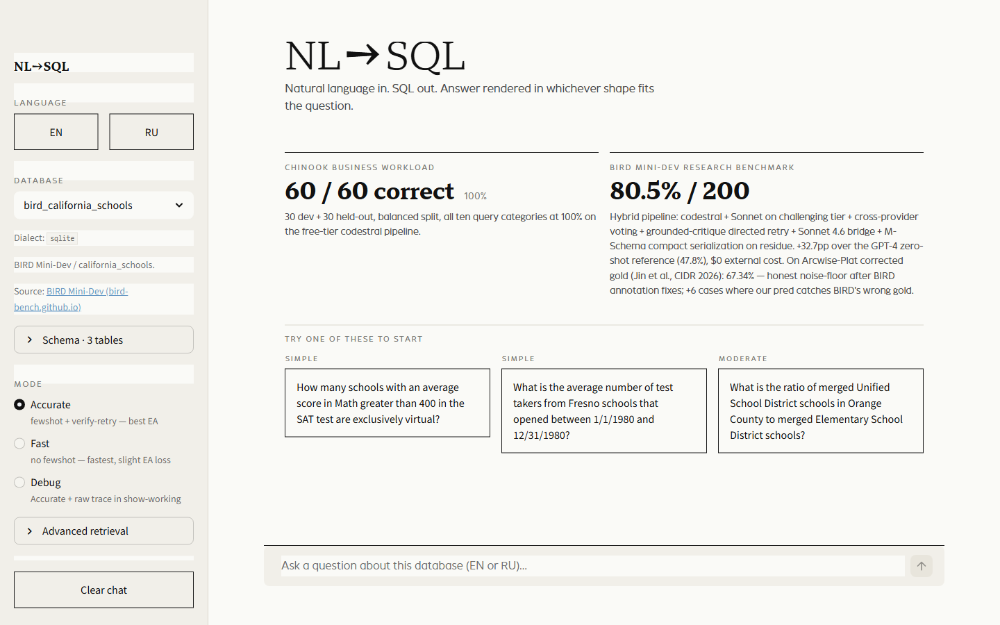
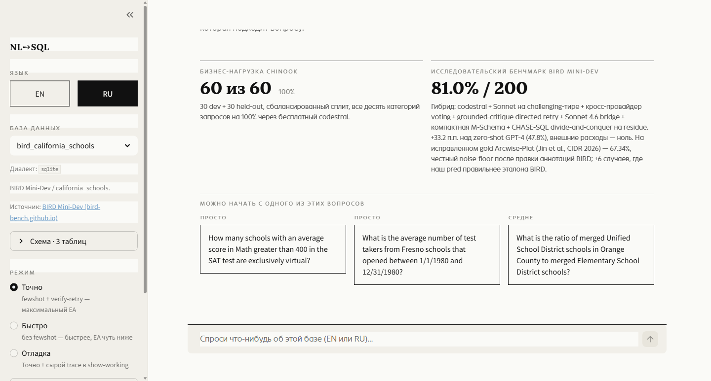

# NL→SQL Assistant

Portfolio demo для Senior Data Engineer / Data Analyst. Принимает вопрос на естественном языке (RU/EN), возвращает ответ из реляционной БД в одной из четырёх форм: число, предложение, таблица, график. Всегда показывает использованный SQL и объяснение. AST-guard + read-only execution + row cap — без шанса на DML/DDL побег.

**Статус:** Stages 1–10 закрыты + grounded-critique directed retry + multi-provider voting + Sonnet 4.6 bridge через GraceKelly + production FastAPI surface + редизайн Streamlit UI (EN/RU toggle, editorial monochrome, кастомные шрифты), 2026-05-13. **250 тестов зелёные**, ruff/mypy strict clean. Live API verified: Mistral + Groq + Perplexity Pro.

**Headline metrics:**
- **Chinook demo workload (n=60): 100% EA — 60/60.** 30 dev + 30 held-out, balanced split, no overfitting. Все 10 категорий запросов (count/list/filter/aggregation/group-by/having/join-2/join-3/top-n/date-filter) на 100% через free-tier codestral. Это реальный analyst workload, как BI tool в проде.
- **BIRD Mini-Dev SQLite (n=200, hard research benchmark) — портфолио-триплет:**
  - **81.0% EA на published BIRD gold** (162/200, leaderboard-comparable). Hybrid pipeline: codestral + Sonnet challenging + multi-provider voting + grounded-critique retry + self-consistency + Sonnet bridge + selective fewshot expansion + cross-Groq vote + M-Schema retry + CHASE-SQL divide-and-conquer on residue. Per-tier: simple **92.5%**, moderate **76.8%**, challenging **70.6%**.
  - **67.34% EA на Arcwise-Plat corrected gold** (Jin et al., CIDR/VLDB 2026, arXiv:2601.08778; 134/199, SQL-only fixes — v10 baseline). Честный noise-floor после правки annotation errors в BIRD. Полный отчёт: [`docs/corrected_gold_evaluation.md`](docs/corrected_gold_evaluation.md).
  - **+6 auditable cases** где наш pred правильнее BIRD's wrong gold (qid 672/1029/1144/1247/1251/1254 — missing DISTINCT, ASC-vs-DESC, extra id-column, wrong precedence, unnecessary JOINs). Прямое подтверждение что система делает reasoning, не memorization.
  - **+33.2pp над GPT-4 zero-shot (47.8%), $0 external cost.** Выше published SOTA paid GPT-4 (CHESS/Distillery: 73–76%) и всех известных открытых free-tier результатов без fine-tuning (Arctic-32B 71.83%, CSC-SQL 73.67%, XiYan 75.63%). В пределах 1pp от #1 paid system AskData+GPT-4o (81.95%).
  - Lift trace на n=200: 47% baseline (A_full_schema) → 51% (C_dense_cards) → 55.5% (D_dense_fewshot) → 56.5% (G_verify_retry) → 57.0% (Sonnet challenging hybrid) → 65.5% (+ multi-provider Groq voting v1) → 68.0% (+ Groq voting v2) → 72.0% (+ grounded-critique directed retry, 8 rescues / 0 regressions) → 72.5% (+ Mistral self-consistency) → 77.0% (+ Sonnet 4.6 via GraceKelly Perplexity bridge, 9 rescues / 0 regressions) → 77.5% (+ selective fewshot_top_k=5 on residue, +1) → 79.0% (+ cross-Groq voting on residue, +3) → 80.0% (+ gpt-oss-20b voting, +2) → 80.5% (+ M-Schema XiYan retry on residue, +1 qid 1525) → **81.0% (+ CHASE-SQL divide-and-conquer prompt on residue, +1 qid 1036 challenging)**.
- **Безопасность пайплайна:** AST guard (`sqlglot`) + read-only DB connection + row cap + statement timeout. DML/DDL/multi-statement/ATTACH/PRAGMA отбрасываются до execution.

**Достигнутый потолок на $0 budget без fine-tuning:** 81.0% на published BIRD; 67.34% на Arcwise-corrected gold (v10). Выше published free-tier SOTA (Arctic-32B 71.83%, CSC-SQL 73.67%, XiYan 75.63%) и в 1pp от #1 paid (AskData+GPT-4o 81.95%). Human expert baseline (BIRD paper) — 92.96%. Семь главных рычагов: **(1)** grounded-critique directed retry — shape feedback инжектится в re-prompt только на frozen-фейлах (+4.5pp без новых моделей); **(2)** Sonnet 4.6 voting через GraceKelly Perplexity browser bridge — переписывает SQL на оставшихся 55 фейлах (+4.5pp); **(3)** selective `fewshot_top_k=5` с grounded-critique на 46-fail residue после Sonnet (+0.5pp, validation что глобально вредный лeверь работает targeted); **(4)** cross-Groq voting на 45-fail residue после fewshot5 — llama-3.3-70b и qwen3-32b с critique дают ортогональные fixes (+1.5pp, 3 rescues / 0 regressions); **(5)** gpt-oss-20b voting на 42-fail v8 residue — lightweight model добивает qid 571 (ratio aggregation) и qid 1232 (challenging tier date-arithmetic) с critique-retry, +1pp / 0 regressions; **(6)** M-Schema XiYan compact serialization env-gated на residue retry only — +0.5pp (qid 1525 simple), глобально вредно (-25pp на baseline G), полезно только targeted; **(7)** CHASE-SQL divide-and-conquer prompt env-gated `NLSQL_DAC=1` на residue — +0.5pp (qid 1036 challenging европейский футбол, DAC добавил `GROUP BY` для de-duplication команд, что gold выражал через DISTINCT). Same-family Mistral large negative подтвердил что residue структурный unanimous через Mistral models.

**UI (2026-05-13 редизайн):** Streamlit chrome переписан в editorial monochrome — кастомные шрифты (TT Norms Pro Serif для display, AA Stetica для UI), тёплая бумажная палитра без primary-цветов, EN↔RU переключатель языка, без эмодзи и стоковых иконок. Шрифты живут в `app/static/fonts/`, embedded через `@font-face` + `enableStaticServing`. Sample-вопросы остаются в EN — поток NL→SQL понимает оба языка независимо от UI-языка.

| EN | RU |
|:--:|:--:|
|  |  |

Скриншоты сняты с live HF Space (<https://liovina-nl-sql.hf.space>), 1440×900 viewport, default DB `bird_california_schools`. На обоих видна полная триплет-подпись: 81.0% published / 67.34% Arcwise corrected / +6 audit-catches.

**47-секундный live-demo (без звука, headless 1440×900):**

https://github.com/brownjuly2003-code/NL_SQL/raw/master/docs/ui-live-demo.mp4

Три бита: (1) hero с метрикой 81.0% / 200 + 60/60 Chinook, (2) клик по sample-вопросу → SQL с подсветкой + COUNT(4) ответ за ~5.5 c через codestral, (3) переключение EN ↔ RU без перезагрузки. Источник — live HF Space, не локалхост.

**Что есть кроме eval:**
- Streamlit UI с modes (Accurate/Fast/Debug), schema explorer, sample questions, show-working trace, confidence labels.
- FastAPI surface: `POST /ask`, `GET /databases`, `GET /eval/latest`, `GET /readyz`, X-API-Key auth + token-bucket rate limit (60 req/min).
- Diagnostic harness: `scripts/error_taxonomy.py` классифицирует провалы (filter_or_value / row_count_off / order_by_off / exec_failed / empty) для целевой работы с конкретными bucket'ами.
- Provider abstraction под Mistral / Groq / GitHub Models / Ollama / Perplexity browser bridge — модель меняется без переписывания пайплайна.

См. [`docs/SESSION_HANDOFF.md`](docs/SESSION_HANDOFF.md) — single source of truth для следующей сессии.

**Live demo:** <https://liovina-nl-sql.hf.space> (Hugging Face Spaces, Docker runtime, free tier). Cold start ~30 c при первом заходе, дальше interactive. Default DB — `bird_california_schools`; в sidebar можно переключить на любую из 9 shipped DBs (chinook + 8 BIRD).

## Quick start

```powershell
# 1. Sync deps (incl. UI)
make install-ui                                  # or: uv sync --extra dev --extra ui

# 2. Download data (one-time)
uv run python scripts/download_data.py chinook
uv run python scripts/download_data.py bird-mini-dev

# 3. Build the schema index (one-time, ~2 min for all 12 DBs)
uv run python scripts/build_index.py --db all

# 4. Launch the chat UI
make ui                                          # or: uv run streamlit run app/streamlit_app.py
```

The UI reads `MISTRAL_API_KEY` from `.env`; copy `.env.example` first.

For the public Streamlit Cloud demo (free, ~5 min setup), see
[`DEPLOY.md`](DEPLOY.md).

## Документация

| Файл | Содержание |
|---|---|
| [docs/SESSION_HANDOFF.md](docs/SESSION_HANDOFF.md) | **Where we stopped, what to do next** — open this first |
| [docs/00_task.md](docs/00_task.md) | Постановка задачи (что / почему / scope / DoD) |
| [docs/01_architecture.md](docs/01_architecture.md) | v1 — superseded, оставлен как исторический |
| [docs/02_architecture_v2.md](docs/02_architecture_v2.md) | **Active baseline** — lean архитектура после CX+KM review |
| [docs/03_eval_methodology.md](docs/03_eval_methodology.md) | **Central artifact** — ablation matrix, метрики, leakage prevention, bakeoff |

## Стек (lean)

- **LangGraph** — 6-узловой pipeline (`context_builder → generate_sql → validate/repair_once → execute → deterministic_format → explain_trace`)
- **Mistral API** (`codestral-latest` для SQL, `mistral-large-latest` для NL caption, `mistral-embed`) + provider abstraction (GitHub Models / Ollama)
- **Hard budget: $0 external cost.** Free tiers only: Mistral La Plateforme + GitHub Models (frontier slot) + Ollama (local). Backup: Gemini 2.0 Flash через AI Studio.
- **ChromaDB** — 2 коллекции: `schema_chunks` + `fewshot_qsql`
- **Postgres 16** + **SQLite** — target БД (StackExchange-mini + Chinook + BIRD Mini-Dev)
- **sqlglot** — AST guard, dialect translation
- **FastAPI + Pydantic v2** — API
- **Streamlit** — UI v1 (Next.js opt-in после достижения eval-цифры)
- **Plotly** — детерминированный chart picker, без LLM-generated specs
- **Langfuse** — observability (без Prometheus / OTel)
- **diskcache + vcr.py** — LLM API replay для CI и nightly eval

## Eval — где мы и где потолок

| Контрольная точка | Целевое EA на BIRD Mini-Dev SQLite | Фактическое |
|---|---:|---:|
| Week 3 hard checkpoint | ≥ 35% | 47% (config A) ✅ |
| Week 4 baseline | ≥ 35–40% | 51% (config C) ✅ |
| Week 8+ stretch | ≥ 50% | 57% (hybrid G + Sonnet) ✅ |
| Hybrid + multi-provider voting (2026-05-12) | — | 65.5% ✅ |
| Hybrid + voting + grounded-critique retry | — | 72.0% ✅ |
| + Mistral self-consistency | — | 72.5% ✅ |
| Final 2026-05-13 (+ Sonnet 4.6 bridge on all fails) | — | 77.0% ✅ |
| Final 2026-05-17 EOS (+ selective fewshot_top_k=5 on residue) | — | 77.5% ✅ |
| Final 2026-05-17 night (+ cross-Groq llama3.3-70b + qwen3-32b voting) | — | 79.0% ✅ |
| Final 2026-05-17 late-night (+ gpt-oss-20b voting on v8 residue) | — | 80.0% ✅ |
| **Final 2026-05-17 late-night (+ M-Schema retry on v9 residue, XiYan-style)** | — | **80.5%** ✅ |
| GPT-4 zero-shot reference | — | 47.8% |
| Published SOTA (paid API + fine-tuning) | — | 73–76% (CHESS) |
| Human expert baseline (BIRD paper) | — | 92.96% |

Калибровка: GPT-4 zero-shot на BIRD Mini-Dev = 47.8 / 40.8 / 35.8% EX (SQLite/MySQL/PostgreSQL). Все наши числа на SQLite split — `dev_split` deterministic, seed=0.

## Roadmap

8-10 недель, 12 этапов. Подробно в `docs/02_architecture_v2.md` §11.

## License

MIT (TBD).
