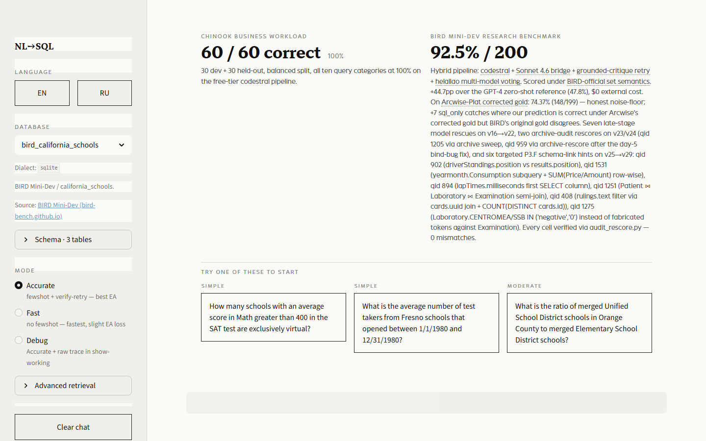
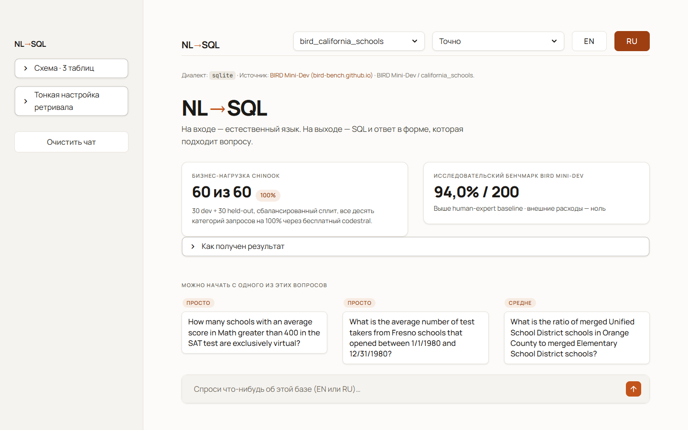

# NL→SQL Assistant

[](https://liovina-nl-sql.hf.space) [](https://github.com/brownjuly2003-code/NL_SQL/actions/workflows/ci.yml)   

Portfolio demo для Senior Data Engineer / Data Analyst. Принимает вопрос на естественном языке (RU/EN), возвращает ответ из реляционной БД в одной из четырёх форм: число, предложение, таблица, график. Всегда показывает использованный SQL и объяснение. AST-guard + read-only execution + row cap — без шанса на DML/DDL побег.

**Статус:** Stages 1–10 закрыты. Production FastAPI surface, retrieval-augmented LangGraph pipeline, редизайн Streamlit UI с EN/RU-переключателем (детали дизайна — в разделе UI ниже). Тесты, ruff и mypy --strict гоняются в CI (бейдж выше — живой). Live API verified на Mistral + Groq.

**Headline metric — три честных уровня (BIRD Mini-Dev SQLite, n=200, $0 free-tier)**

Одно число вводило бы в заблуждение, поэтому метрика разложена по слоям. Только уровень 1 включён в продукт (Streamlit UI и `/ask`); уровни 2–3 — eval-конфигурация.

| Уровень | EA | Что это | В продукте? | Воспроизводится? |
|---|---:|---|:--:|:--:|
| **1. Reproducible single-run** | **61.5%** | Чистый пайплайн на free-tier codestral, один прогон, без голосования и подсказок (123/200). | ✅ да | ✅ одной командой |
| **2. + per-question schema-link hints** | **62.5%** | Тот же прогон с флагом `--bird-rescue-hints` (125/200): 11 hint-блоков под annotation-quirks конкретных BIRD-вопросов. Кодирует ответы к тесту — **в продукте выключен** (`enable_bird_rescue_hints`, off). | ❌ eval | ✅ одной командой |
| **3. + multi-provider voting** | 85.5% | Само-консистентность + голосование по нескольким провайдерам. | ❌ eval | ❌ архив (Perplexity-bridge истёк 16.06) |
| **4. + hints поверх voting-архива** | 94.0% | **Не «пайплайн с подсказками», а накопительный merge ~20 слоёв** (188/200): голосование codestral + Sonnet 4.6 + GPT-5.2 + Grok-4.1 + Kimi-K2 + Llama-4 + Qwen3 + gpt-oss через Groq/OpenRouter/Perplexity-мосты, плюс archive-rescore и те же hints. | ❌ eval | ❌ архив |

Уровень 1 — first-pass 59.5%, per-tier simple 76.1% / moderate 58.6% / challenging 41.2% ([`eval/baselines/reproducible_n200.json`](eval/baselines/reproducible_n200.json), отдаётся `GET /eval/latest`).

```powershell
# Уровень 1 (одна команда, детерминированный split, seed=0):
uv run python scripts/eval_baseline.py --config E --n 200            # → 61.5%
# Уровень 2 (hint-assisted, eval-only) — тот же прогон с флагом:
uv run python scripts/eval_baseline.py --config E --n 200 --bird-rescue-hints   # → 62.5%
```

Уровни 3–4 этими командами **не получить**: это архивные композиции многих прогонов разных провайдеров, а не конфигурация пайплайна. Артефакт уровня 4 — `eval/reports/2026-05-26/v31-v30-plus-p3f-q37-merged.json`; его поле `sql_model` перечисляет весь ансамбль.

Почему так честнее: уровень 4 выше human-expert baseline (92.96%), но стоит на ансамбле из двух десятков прогонов **и** на per-question подсказках — открыв `_hints.py`, ревьюер увидит их сразу. Разделение на слои показывает и инженерию (воспроизводимые 61.5%), и научную честность (какой именно слой что даёт), вместо одного числа, которое злой ревьюер спишет целиком.

- **Chinook demo workload (n=60): 100% EA — 60/60.** 30 dev + 30 held-out, сбалансированный split. Все 10 категорий (count/list/filter/aggregation/group-by/having/join-2/join-3/top-n/date-filter) через free-tier codestral — реальный analyst workload.
- **74.37% EA на Arcwise-corrected gold** (Jin et al., CIDR/VLDB 2026) — noise-floor после исправления annotation-ошибок BIRD. Отчёт: [docs/corrected_gold_evaluation.md](docs/corrected_gold_evaluation.md).
- **Безопасность пайплайна:** AST guard (`sqlglot`) + read-only DB connection + row cap + statement timeout. DML/DDL/multi-statement/ATTACH/PRAGMA/`SELECT … INTO` отбрасываются до execution.

Полная по-версионная lift-трасса, saturation-evidence и audit-методология — в [docs/03_eval_methodology.md](docs/03_eval_methodology.md).

**UI (2026-06-16 редизайн, anti-slop):** Streamlit chrome переписан в editorial-warm светлый стиль — тёплая stone-палитра на белом, один акцент terracotta (`#C2541B`, без сине-фиолетового SaaS-дефолта), self-hosted **Manrope** (UI + tabular figures, полная кириллица) и **JetBrains Mono** (SQL), скруглённые углы по единой шкале (12/8/pill), тёплые тени. Контролы вынесены в закреплённый (sticky) верхний бар: база, режим и переключатель EN↔RU. В сайдбаре остались только schema explorer, advanced retrieval и clear chat — без скролла. Hero + две stat-карточки + свёрнутый блок методологии. Контраст текста/кнопок/ссылок проверен на WCAG AA, focus-ring на всех интерактивных элементах. Без эмодзи и стоковых иконок. Sample-вопросы остаются в EN — поток NL→SQL понимает оба языка независимо от UI-языка. Живой Space `liovina-nl-sql.hf.space` задеплоен на этот дизайн; скриншоты ниже пересняты с live.

| EN | RU |
|:--:|:--:|
|  |  |

Скриншоты сняты с live HF Space (<https://liovina-nl-sql.hf.space>), 1440×900 viewport, default DB `bird_california_schools`. Сняты на более раннем билде (в подписи на изображении — историческая метрика); актуальная метрика — см. таблицу трёх уровней выше.

**47-секундный live-demo (без звука, headless 1440×900):**

https://github.com/brownjuly2003-code/NL_SQL/raw/main/docs/ui-live-demo.mp4

Три бита: (1) hero с метрикой (видео снято на более раннем билде; актуальная метрика — см. таблицу выше), (2) клик по sample-вопросу → SQL с подсветкой + COUNT(4) ответ за ~5.5 c через codestral, (3) переключение EN ↔ RU без перезагрузки. Источник — live HF Space, не локалхост.

**Что есть кроме eval:**
- Streamlit UI с modes (Accurate/Fast/Debug), schema explorer, sample questions, show-working trace, confidence labels.
- FastAPI surface: `POST /ask`, `GET /databases`, `GET /eval/latest`, `GET /readyz`, X-API-Key auth + token-bucket rate limit (60 req/min).
- Diagnostic harness: `scripts/error_taxonomy.py` классифицирует провалы (filter_or_value / row_count_off / order_by_off / exec_failed / empty) для целевой работы с конкретными bucket'ами.
- Provider abstraction под Mistral / Groq / GitHub Models / Ollama / Perplexity browser bridge — модель меняется без переписывания пайплайна.

**Live demo:** <https://liovina-nl-sql.hf.space> (Hugging Face Spaces, Docker runtime, free tier). Cold start ~30 c при первом заходе, дальше interactive. Default DB — `bird_california_schools`; в sidebar можно переключить на любую из 9 shipped DBs (chinook + 8 BIRD).

## Quick start

```powershell
# 1. Sync deps (incl. UI)
make install-ui                                  # or: uv sync --extra dev --extra ui

# 2. Download data (one-time)
uv run python scripts/download_data.py chinook
uv run python scripts/download_data.py bird-mini-dev

# 3. Build the schema index (one-time, ~2 min for all 12 DBs)
uv run python scripts/build_index.py --db all

# 4. Launch the chat UI
make ui                                          # or: uv run streamlit run app/streamlit_app.py
```

The UI reads `MISTRAL_API_KEY` from `.env`; copy `.env.example` first.

Публичный демо — Hugging Face Space (Docker). Как он деплоится (tracked-only + prune),
см. [`DEPLOY.md`](DEPLOY.md).

## Документация

| Файл | Содержание |
|---|---|
| [docs/BACKLOG.md](docs/BACKLOG.md) | Живой трекер: что сделано, что gated, что won't-fix |
| [docs/00_task.md](docs/00_task.md) | Постановка задачи (что / почему / scope / DoD) |
| [docs/01_architecture.md](docs/01_architecture.md) | v1 — superseded, оставлен как исторический |
| [docs/02_architecture_v2.md](docs/02_architecture_v2.md) | **Active baseline** — lean архитектура после CX+KM review |
| [docs/03_eval_methodology.md](docs/03_eval_methodology.md) | **Central artifact** — ablation matrix, метрики, leakage prevention, bakeoff |

## Стек (lean)

- **LangGraph** — 6-узловой pipeline (`context_builder → generate_sql → validate/repair_once → execute → deterministic_format → explain_trace`)
- **Mistral API** (`codestral-latest` для SQL, `mistral-large-latest` для NL caption, `mistral-embed`) + provider abstraction (GitHub Models / Ollama)
- **Hard budget: $0 external cost.** Primary: Mistral La Plateforme (`codestral-latest` SQL + `mistral-large-latest` NL + `mistral-embed`). Voting layers cycled через free-tier Groq (llama-3.3-70b / qwen3-32b / gpt-oss-20b — TPM/TPD-bounded) + OpenRouter free models (nemotron-3-super-120b — 50/day account-wide) + Sonnet 4.6 via GraceKelly Perplexity bridge (Chrome-gated). См. `docs/v11_saturation_evidence.md` для actual reach × rescues × why-stopped per провайдер.
- **ChromaDB** — 2 коллекции: `schema_chunks` + `fewshot_qsql`
- **SQLite** (read-only) — target БД по умолчанию: Chinook + 11 BIRD Mini-Dev slices локально (вся eval на SQLite); на live Space — 9 (три самых больших > 100 MB/файл, см. DEPLOY.md).
- **Postgres 16** — второй backend с genuinely read-only транзакциями (execution-option, не роль-плацебо); запускается локально через `docker-compose.yml` (profile `postgres`). **Прогнан, а не только заявлен:** `codebase_community` (StackExchange-mini, 741 646 строк) залит из официального BIRD PG-дампа (`scripts/extract_pg_dump_slice.py`), и тот же пайплайн на BIRD-овском **Postgres-gold** даёт **49.0% EA (24/49)** против 44.9% на SQLite для тех же вопросов, validity 100% — движок переносим. Живой прогон нашёл два бага, невидимых на SQLite (`%` в `LIKE` ронял psycopg-путь; `Decimal` из `numeric` занижал скоринг) — оба починены, см. `docs/03_eval_methodology.md` §14. Read-only enforcement проверяется на живом PG16 в CI. На HF Space не тянется (SQLite-only деплой).
- **sqlglot** — AST guard, dialect translation
- **FastAPI + Pydantic v2** — API (X-API-Key + безусловный token-bucket rate-limit)
- **Streamlit** — UI
- **Plotly** — детерминированный chart picker, без LLM-generated specs
- **diskcache** — кэш LLM generate/embed ответов (используется и для быстрого детерминированного прогона eval)

## Eval — где мы и где потолок

| Контрольная точка | Целевое EA | Фактическое |
|---|---:|---:|
| Week 3 hard checkpoint | ≥ 35% | 47% (config A) ✅ |
| Week 4 baseline | ≥ 35–40% | 51% (config C) ✅ |
| Week 8+ stretch | ≥ 50% | 57% (hybrid + Sonnet) ✅ |
| + multi-provider voting (2026-05-12) | — | 65.5% ✅ |
| + grounded-critique directed retry | — | 72.0% ✅ |
| + Sonnet 4.6 bridge на all-fails (2026-05-13) | — | 77.0% ✅ |
| + cross-Groq / gpt-oss / M-Schema / CHASE-SQL DAC voting (2026-05-17) | — | 81.0% ✅ |
| + helallao Perplexity Pro / reasoning-mode voting (2026-05-18) | — | 85.5% (saturation ceiling, BIRD-official set scoring) |
| + post-cooldown Pro/reasoning rescues v17–v21 (2026-05-23) | — | 88.0% ✅ |
| + targeted P3.F schema-link hints + archive-rescore v22–v31 (2026-05-26) | — | **94.0%** ✅ |
| GPT-4 zero-shot reference | — | 47.8% |
| Published SOTA (paid API + fine-tuning) | — | 73–76% (CHESS) |
| Human expert baseline (BIRD paper) | — | 92.96% |

Это историческая lift-трасса архива, не воспроизводимое одно число. Строки 85.5% и 94.0% — voting- и voting+hint-слои (eval-only, см. таблицу уровней в начале): каждая получена merge'ем множества прогонов разных провайдеров, а не одной конфигурацией. Воспроизводимый продуктовый пайплайн — **61.5%** (уровень 1), с подсказками — **62.5%** (уровень 2).

> Полная по-версионная трасса, per-qid rescues, saturation-evidence и audit-методология — в [`docs/03_eval_methodology.md`](docs/03_eval_methodology.md).

Калибровка: GPT-4 zero-shot на BIRD Mini-Dev = 47.8 / 40.8 / 35.8% EX (SQLite/MySQL/PostgreSQL). Все наши числа на SQLite split — `dev_split` deterministic, seed=0.

## Roadmap

Stages 1–10 закрыты (см. статус выше). Дальнейшие этапы и архитектурный контекст — `docs/02_architecture_v2.md` §11.

## License

MIT. See [LICENSE](LICENSE).
